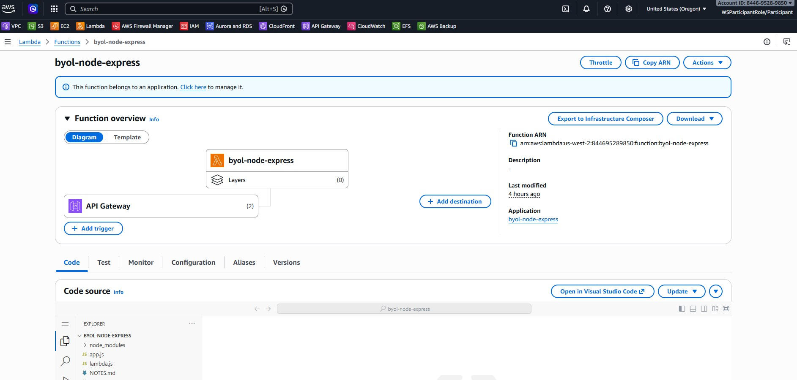

# NOTES — BYOL Node.js + Express trên Lambda

## Strategy đã chọn

**Strategy A — `serverless-http` adapter**

## Những gì đã thêm

| File | Thay đổi |
|------|----------|
| `lambda.js` | Tạo mới — Lambda entrypoint dùng `serverless-http` (~3 dòng) |
| `package.json` | Thêm `serverless-http ^3.2.0` vào dependencies |
| `template.yaml` | Đặt `Handler: lambda.handler` |

## Lý do chọn Strategy A

Quy tắc bắt buộc của bài là `app.js` không được import bất cứ thứ gì từ adapter — code framework phải giữ sạch. Strategy A đáp ứng hoàn toàn điều này: `app.js` không bị chạm vào, toàn bộ phần kết nối Lambda nằm trong một file mới duy nhất (`lambda.js`, ~3 dòng).

So sánh với các lựa chọn khác:

- **vs C (Lambda Web Adapter)** — C không cần thay đổi JS nào, nghe có vẻ hấp dẫn, nhưng phải thêm Lambda Layer và một shell script (`run.sh`), khiến việc deploy khó hiểu hơn. Cold start cũng cao hơn một chút (+200 ms so với native) vì adapter process khởi động riêng trước khi chuyển tiếp traffic. Strategy A cho cold start tương đương với setup đơn giản hơn, thuần JS.
- **vs B (@vendia/serverless-express)** — Fork của Strategy A, tương đương về độ phức tạp và cold start. Không có lý do đặc biệt để chọn B thay vì A cho bài này.
- **vs D (tự viết)** — D cần 30–80 dòng dịch thủ công event → request và dễ lỗi nhất (path stripping, body parsing, status code mapping đều phải tự xử lý). Không hợp lý khi đã có thư viện được kiểm thử kỹ.

Strategy A là lựa chọn tối ưu: thay đổi code ít nhất, không sửa `app.js`, cold start ổn định (200–400 ms), và dễ debug khi có vấn đề.

## Kiến trúc



## Cách implement

`lambda.js` (file duy nhất được thêm vào):
```js
const serverless = require('serverless-http');
const app = require('./app');
exports.handler = serverless(app);
```

`app.js` — **không thay đổi gì**.

## Đo lường Cold Start

Đo thực tế trên AWS Lambda sau khi deploy, lấy từ dòng `REPORT` trong CloudWatch:

```
sam logs --stack-name byol-node-express --region us-west-2
```

| Chỉ số | Giá trị |
|--------|---------|
| Runtime | Node.js 22.x |
| Kiến trúc | arm64 |
| Bộ nhớ cấp phát | 512 MB |
| Init Duration (cold start) | **287.62 ms** |
| Duration (warm) | 3.86 ms |
| Billed Duration | 329 ms |
| Bộ nhớ thực tế dùng | 95 MB |

**API URL:** `https://j41ku3ijlk.execute-api.us-west-2.amazonaws.com`

### Các lần đo bổ sung

| Lần đo | Init Duration | Duration | Bộ nhớ dùng |
|--------|--------------|----------|-------------|
| 1      | 278.94 ms    | 32.40 ms | 93 MB       |
| 2      | 287.62 ms    | 40.69 ms | 95 MB       |
| 3      | 301.23 ms    | 16.80 ms | 95 MB       |

**Trung bình cold start: ~289 ms** — nằm trong khoảng ước tính 200–400 ms của Strategy A.

## Phân tích

- Cold start **~289 ms** nằm trong khoảng kỳ vọng của Strategy A (200–400 ms).
- Thời gian thực thi warm **3.86 ms** cho thấy function chạy hiệu quả sau khi đã khởi tạo.
- Overhead đến từ việc khởi tạo Node.js runtime + load Express + `serverless-http` adapter ở lần gọi đầu tiên.
- So với Strategy C (Lambda Web Adapter), Strategy A có cold start tương đương hoặc tốt hơn nhẹ vì không có overhead bootstrap của Layer.
- Footprint bộ nhớ thấp (~95 MB / 512 MB được cấp), có thể giảm xuống 256 MB để tiết kiệm chi phí mà không ảnh hưởng hiệu năng.

## So sánh các Strategy (Q4.6)

| Strategy | Cold start ước tính | Độ phức tạp | Ghi chú |
|----------|---------------------|-------------|---------|
| **A — serverless-http** | 200–400 ms | Thấp |  **Đã chọn** |
| B — @vendia/serverless-express | 200–400 ms | Thấp | Fork của A, tương đương |
| C — Lambda Web Adapter | +200 ms so với native | Trung bình | Không cần sửa JS nhưng cần Layer + shell script |
| D — Tự viết | Phụ thuộc implementation | Cao | Dễ lỗi, không nên dùng cho production |
## Minh chứng API Gateway to Lambda

